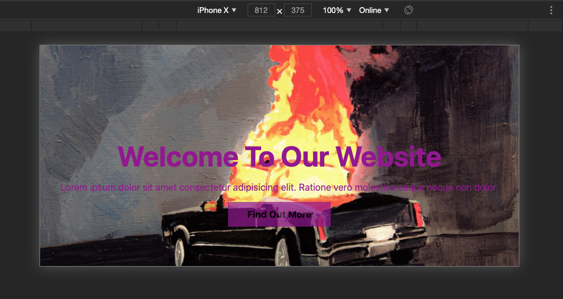
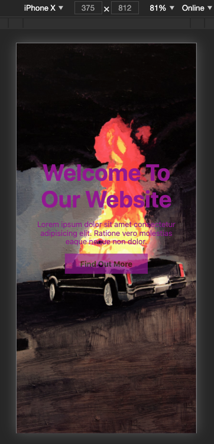
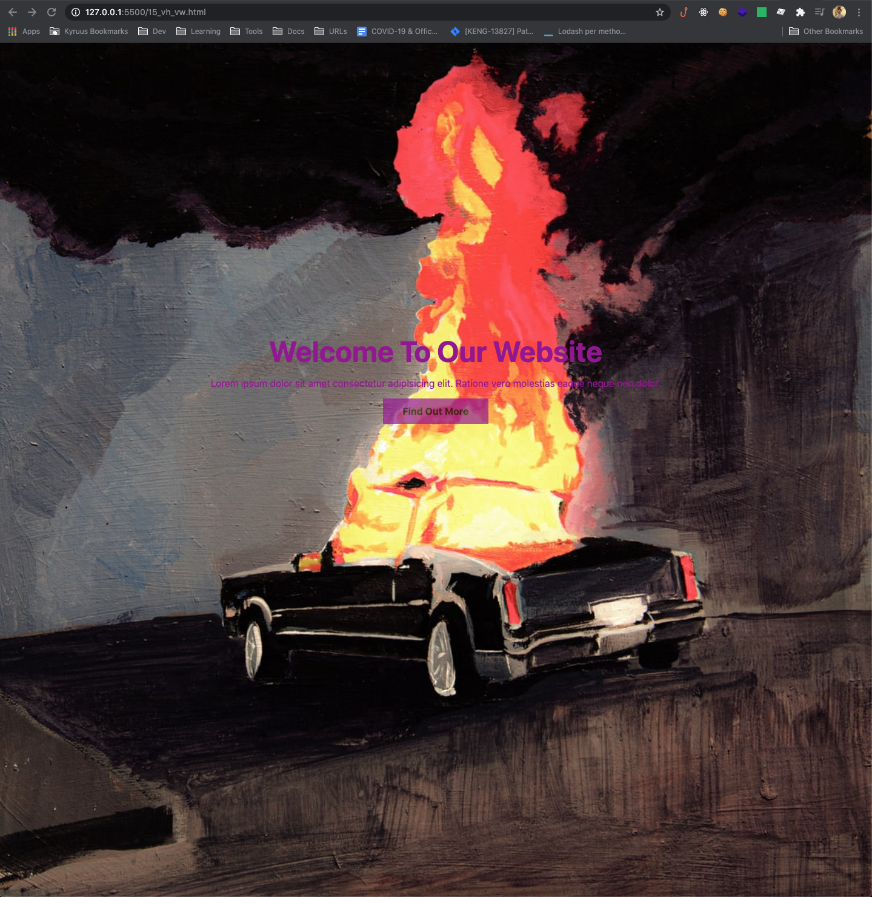

# css-basics

  
   
  

  <label style="display: inline-block; width: 32%; text-align: center;" src="img/previewLandscape.png" alt="iPhoneX landscape screenshot from vh & vw exercize" >iPhoneX Landscape</label>
  <label style="display: inline-block; width: 32%; text-align: center;" src="img/previewVertical.png" alt="iPhoneX vertical orientation screenshot from vh & vw exercize">iPhoneX Vertical</label> 
  <label style="display: inline-block; width: 32%; text-align: center;" src="img/preview.png" alt="Desktop screenshot from vh & vw exercize" >Desktop</label>

 
 

CSS refresh by following TraversyMedia's Udemy Course: Modern HTML & CSS From The Beginning

 

#### Lessons/Git Commits

1. Implementing CSS

1. Basic CSS Selectors

1. Fonts In CSS

1. Color Types

1. Backgrounds & Borders

1. Box Model, Margin & Padding

1. Float & Alignment

1. Link State & Button Styling

1. Navigation Menu Styling

1. Inline, Block & Inline-Block Display

1. Positioning

1. Form Style Challenge / Solution

1. Aside: Visibility, Order & Negative Margin

1. Getting Started With Media Queries

1. Em & Rem Units

1. Vh & Vw Units